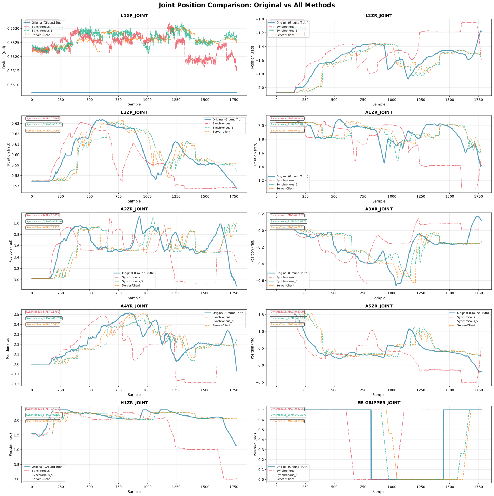
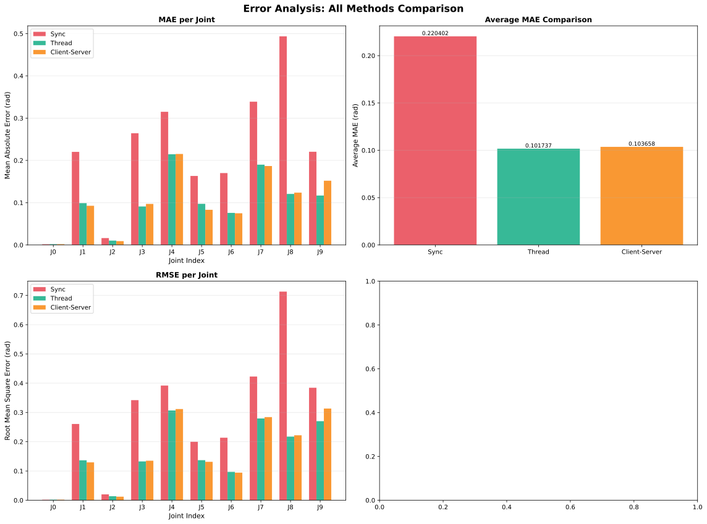
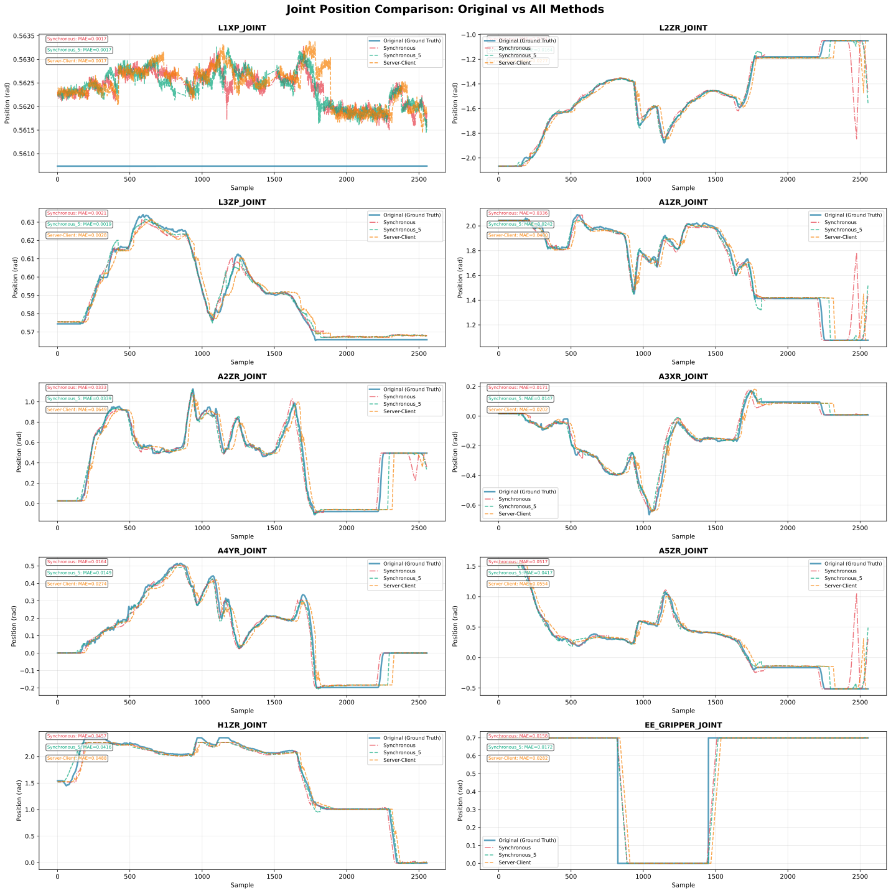
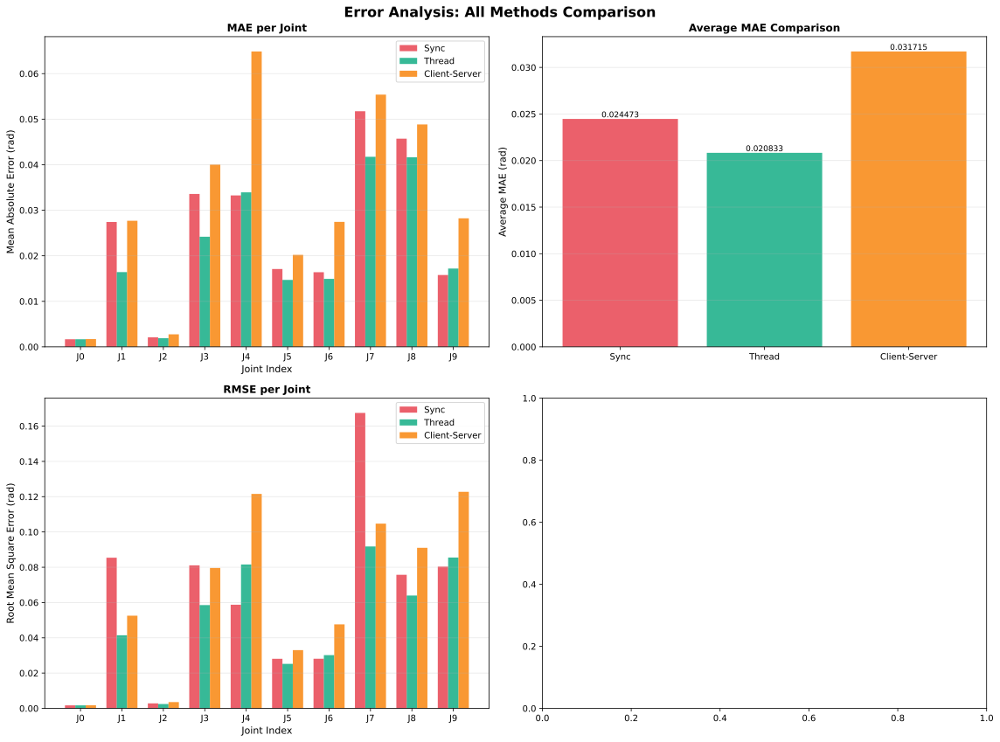
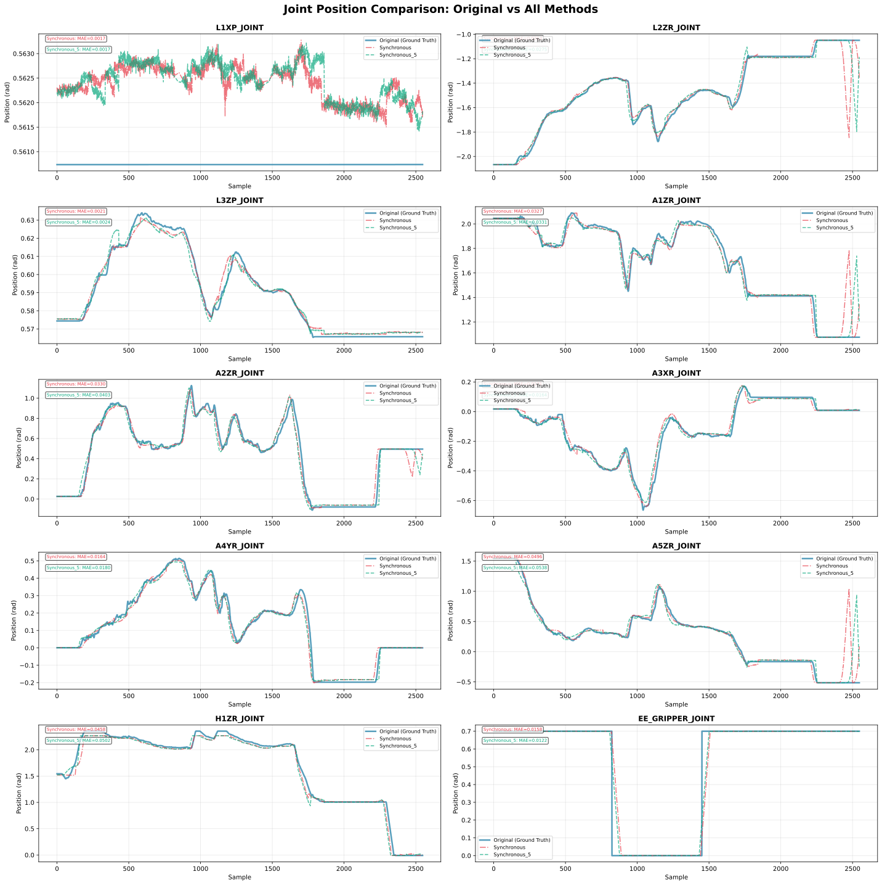
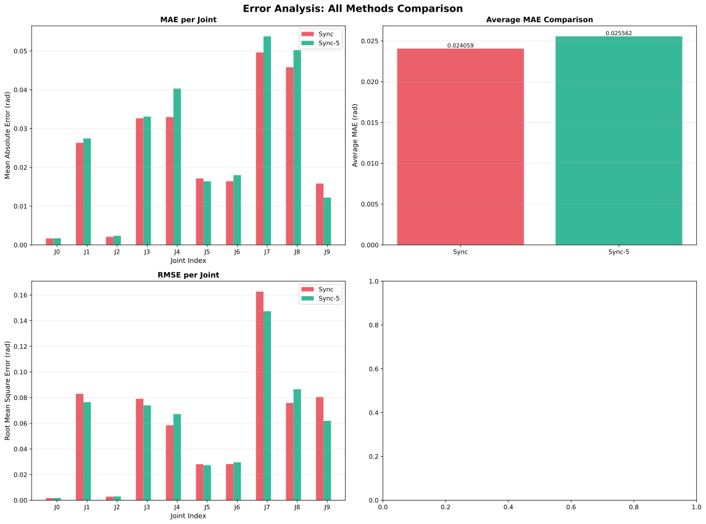

# Asynchronous Inference Implementation Comparison

A comparison of three inference architectures for ACT-based robot control, demonstrating performance differences between synchronous and asynchronous approaches.

---

## 🎯 Overview

This project implements and compares three different inference architectures for ACT-based robot control:

| Method | Type | Use Case |
|--------|------|----------|
| **Synchronous** | Blocking inference | Baseline/lightweight models |
| **Threading** | Non-blocking (Python threading) | Single-machine deployments |
| **Server-Client** | Distributed (socket-based) | Multi-machine robotics systems |

---

## 🚨 Problem Statement

Foundation models introduce computational overhead that can block robot control loops. While ACT is lightweight, this project simulates heavier model inference (e.g., PI0, SmolVLA) by adding an **artificial 0.8s delay** to demonstrate the benefits of asynchronous architectures.

### Why This Matters

- **Synchronous**: Robot freezes during inference ❌
- **Asynchronous**: Robot continues operating smoothly ✅

---

## 🏗️ Architecture Comparison

### 1. Synchronous (Baseline)
```
Control Loop → [Wait for Inference] → Execute Action → Repeat
```
- **Pros**: Simple, no overhead
- **Cons**: Blocks control loop during inference
- **Best for**: Fast models

### 2. Threading
```
Control Loop → Execute Last Action
     ↓              ↑
Inference Thread (parallel)
```
- **Pros**: Non-blocking, low overhead
- **Cons**: single machine only
- **Best for**: Single-machine deployments with heavy models

### 3. Server-Client
```
Robot (Client) → Execute Last Action
     ↓              ↑
Inference Server (remote/parallel)
```
- **Pros**: Distributed, scalable, GPU offloading
- **Cons**: Network latency, more complex
- **Best for**: Multi-robot systems

---

## 🚀 Getting Started


## 🧪 Running Experiments

### Experiment 1: Synchronous (Baseline)

<details>
<summary><b>Click to expand instructions</b></summary>

#### Terminal 1 - Start Inference

```bash
cd assignment_foundation_integration_afshin/foundation_model
docker compose build
docker compose up -d
docker exec -it <container-name> bash

# Inside container
uv run python ./tx-pizero/src/inference/inference.py \
    -b lerobot \
    -c /root/models/2025-06-25-17-17-09_act_clean_data/checkpoints/450000/pretrained_model \
    -f 50 \
    -l 1.0 \
    -i -1 \
    -o teleop_mode
```

#### Terminal 2 - Run Evaluation

```bash
cd assignment_foundation_integration_afshin/ros
docker compose up -d
docker exec -it <container-name> bash

# Inside container
roscore &
cd scripts
./analyze_joint.sh /Teleoperation_Success_2025-4-27_9-14-33_teleop_session_1745712875_9081492.bag
```

⏱️ **Wait Time**: ~58 seconds for trajectory completion

#### Outputs
```
inference/
├── org.csv                      # Original joint states
├── infer.csv                    # Inference predictions
└── all_joints_comparison.png    # Visualization
```

</details>

---

### Experiment 2: Threading

<details>
<summary><b>Click to expand instructions</b></summary>

#### Terminal 1 - Start Threaded Inference

```bash
cd assignment_foundation_integration_afshin/foundation_model
docker exec -it <container-name> bash

# Inside container
uv run python ./tx-pizero/src/inference/inference_thread.py \
    -b lerobot \
    -c /root/models/2025-06-25-17-17-09_act_clean_data/checkpoints/450000/pretrained_model \
    -f 50 \
    -l 1.0 \
    -i -1 \
    -o teleop_mode
```

#### Terminal 2 - Run Evaluation

```bash
cd assignment_foundation_integration_afshin/ros
docker exec -it <container-name> bash

cd scripts
./analyze_joint.sh /Teleoperation_Success_2025-4-27_9-14-33_teleop_session_1745712875_9081492.bag
```

#### Outputs
```
thread/
├── org.csv
├── infer.csv
└── all_joints_comparison.png
```

</details>

---

### Experiment 3: Server-Client

<details>
<summary><b>Click to expand instructions</b></summary>

#### Terminal 1 - Start Inference Server

```bash
cd assignment_foundation_integration_afshin/foundation_model
docker exec -it <container-name> bash

# Inside container
uv run python ./tx-pizero/src/inference/inference_server.py \
    --host 0.0.0.0 \
    --port 50051 \
    -c /root/models/2025-06-25-17-17-09_act_clean_data/checkpoints/450000/pretrained_model \
    --device cuda
```

#### Terminal 2 - Start Client

```bash
cd assignment_foundation_integration_afshin/foundation_model
docker exec -it <container-name> bash

# Inside container
uv run python ./tx-pizero/src/inference/inference_client.py \
    --server_address 127.0.0.1 \
    --server_port 50051 \
    -f 50 \
    -l 1.0 \
    -i -1 \
    -o teleop_mode \
    --actions_per_chunk 50 \
    --chunk_size_threshold 0.5
```

#### Terminal 3 - Run Evaluation

```bash
cd assignment_foundation_integration_afshin/ros
docker exec -it <container-name> bash

cd scripts
./analyze_joint.sh /Teleoperation_Success_2025-4-27_9-14-33_teleop_session_1745712875_9081492.bag
```

#### Outputs
```
client_server/
├── org.csv
├── infer.csv
└── all_joints_comparison.png
```

</details>

---

## 📊 Results Analysis

### Generate Comparison Plots

After running all three experiments:

```bash
cd assignment_foundation_integration/ros
docker exec -it <container-name> bash
cd scripts

# Generate comprehensive analysis
uv run python ./plot.py
```

**Generated Files:**
- `comparison_joints.svg` - Joint tracking comparison
- `comparison_errors.svg` - MAE/RMSE analysis

---

## 📈 Key Findings

### Performance Metrics

| Metric | Description | Best Value |
|--------|-------------|------------|
| **MAE** | Mean Absolute Error | Lower is better |
| **RMSE** | Root Mean Square Error | Lower is better |

---

### Scenario 1: With Artificial Delay (0.8s)

**Simulates heavy models like PI0 or SmolVLA**

<div align="center">

#### Joint Tracking Comparison


#### Error Analysis


</div>

**Observations:**
- ❌ **Synchronous**: Blocks for ~800ms per inference, causing severe tracking lag
- ✅ **Threading**: Control loop maintains 50Hz, smooth tracking
- ✅ **Server-Client**: Similar to threading with minimal network overhead

---

### Scenario 2: Without Delay (Pure ACT)

**Lightweight model with fast inference**

<div align="center">

#### Joint Tracking Comparison


#### Error Analysis


</div>

**Observations:**
- ✅ **All Methods**: ~Similar performance (ACT inference is fast)
- **Threading**: Minimal overhead from thread synchronization
- **Server-Client**: Small network latency (~few ms)

---

### Scenario 3: Higher Action Buffer Optimization

**Based on inference_profiler.py analysis**

<div align="center">

#### Joint Tracking Comparison


#### Error Analysis


</div>

**Trade-offs:**
- **Lower MAE**: Smaller errors on average (conservative buffering)
- **Higher RMSE**: More consistent errors, with occasional large spikes

---

## 🎓 Conclusion

### Key Takeaways

#### When to Use Each Approach

| Scenario | Recommended Method | Reason |
|----------|-------------------|---------|
| Lightweight models | **Synchronous** | Simple, no overhead needed |
| Heavy models on single machine | **Threading** | Non-blocking with minimal overhead |
| Multi-robot/edge deployment | **Server-Client** | Distributed, scalable architecture |

#### Performance Summary

```
Fast Inference (< control cycle):
├── Synchronous ✅ Works fine
├── Threading ⚠️ Adds unnecessary overhead
└── Server-Client ⚠️ Network latency without benefit

Heavy Inference (> control cycle):
├── Synchronous ❌ Robot freezes
├── Threading ✅ Smooth operation
└── Server-Client ✅ Smooth + distributed benefits
```

**Buffer Optimization:**
- Conservative buffering (higher threshold) → Lower MAE
- Aggressive buffering (lower threshold) → Lower latency, higher variance

<div align="center">
<b>Built for robust, production-ready robot control systems</b>
</div>