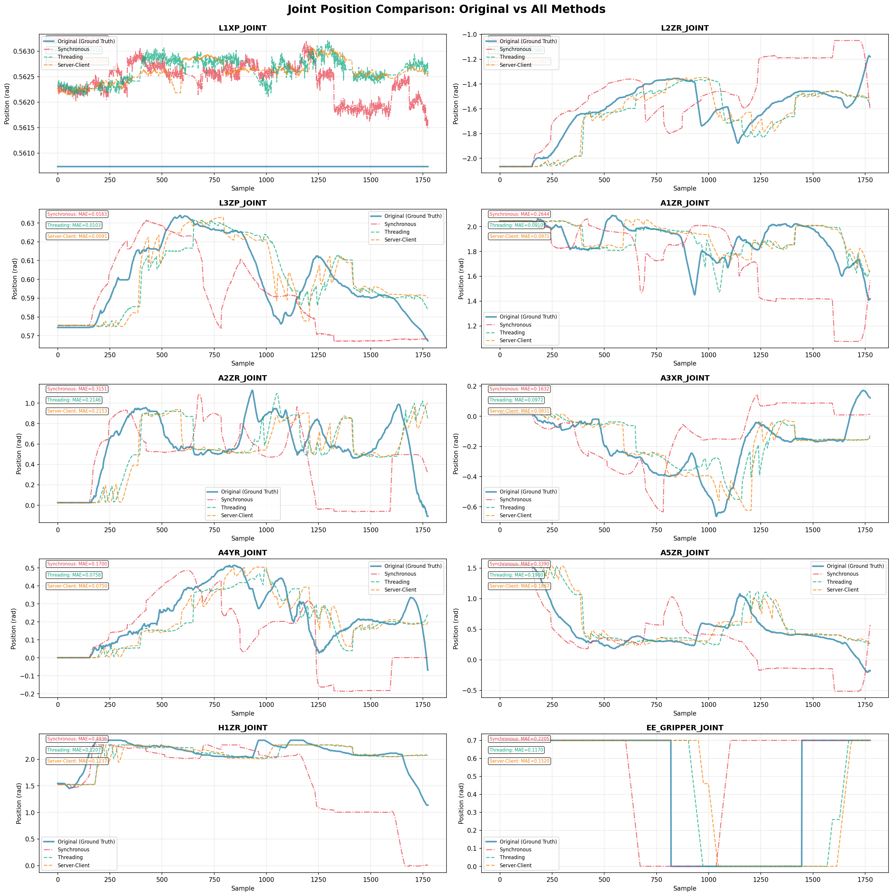
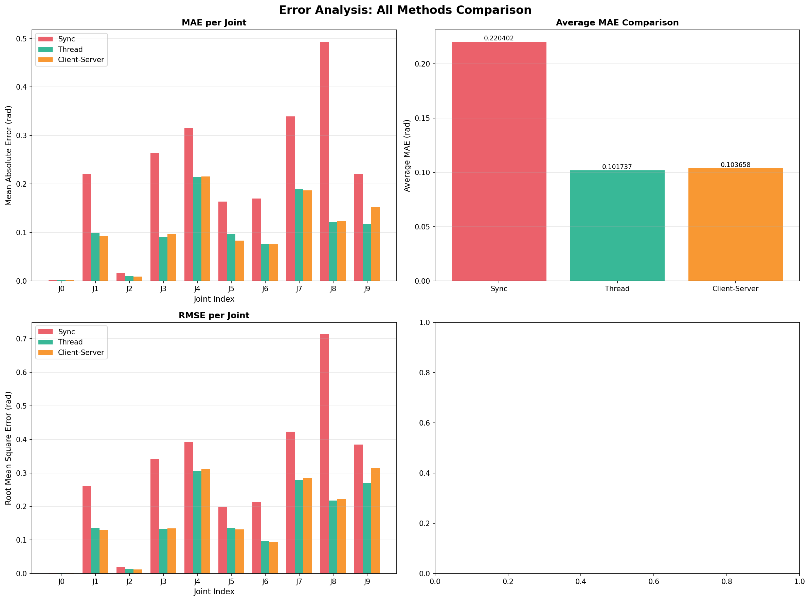
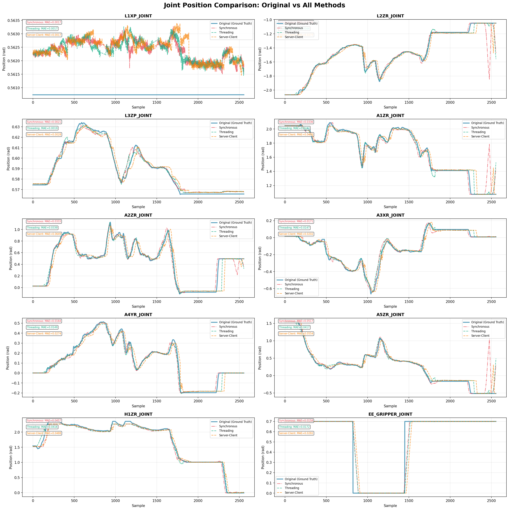
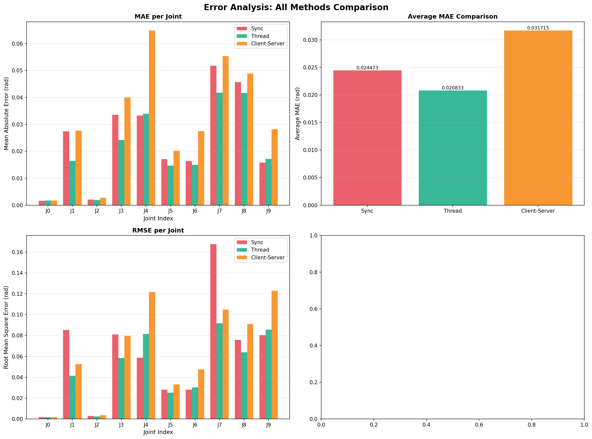
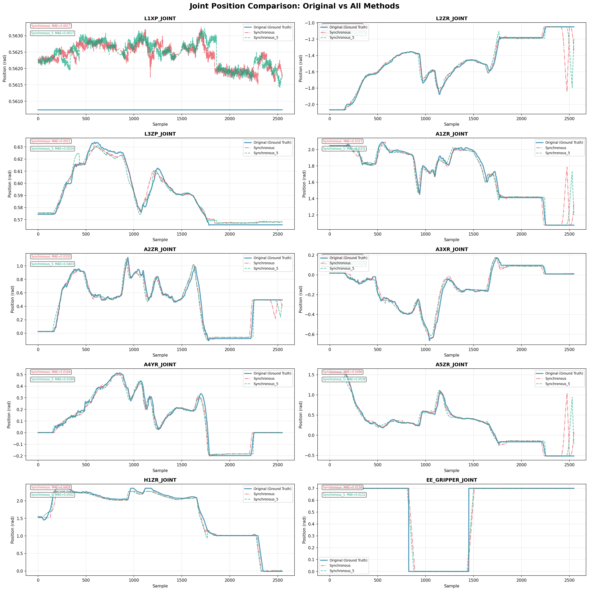
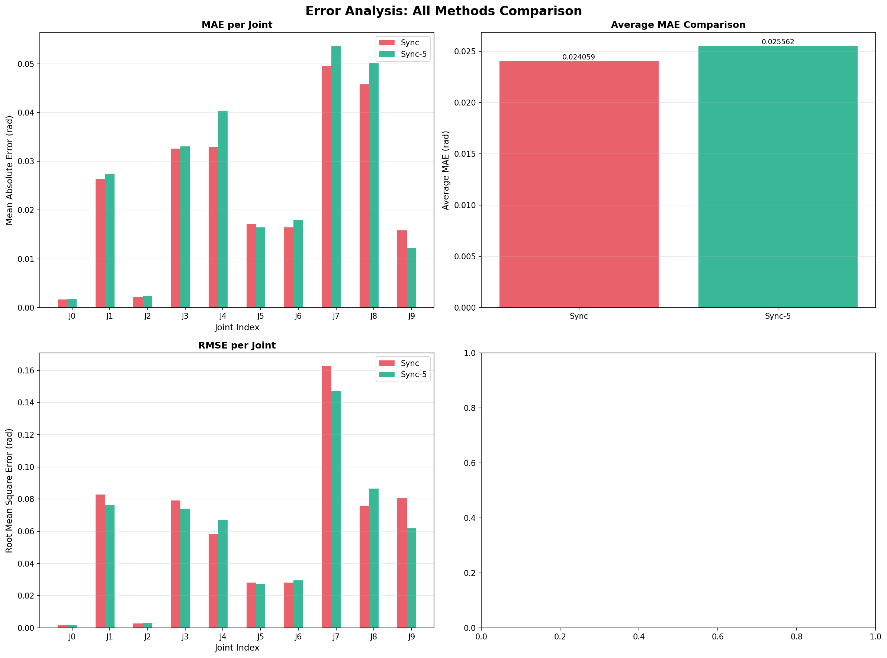

# Asynchronous Inference Implementation Comparison

This project implements and compares three different inference architectures for ACT-based robot control:

1. **Synchronous** - Original blocking inference
2. **Threading** - Non-blocking inference using Python threading
3. **Server-Client** - Distributed inference using socket-based architecture

## 📋 Overview

### Problem Statement
Foundation models introduce computational overhead that can block robot control loops. While ACT is lightweight, I simulated heavier model inference (e.g., PI0, SmolVLA) by adding an artificial 0.8s delay to demonstrate the benefits of asynchronous architectures.

## 📊 Running Experiments

### Method 1: Synchronous (Baseline)

**Terminal 1 - Start Inference:**
```bash
cd <assignment_foundation_integration>/foundation_model
docker compose build
docker compose up -d
docker exec -it <container-name> bash

# Inside container
uv run python ./tx-pizero/src/inference/inference.py \
    -b lerobot \
    -c /root/models/2025-06-25-17-17-09_act_clean_data/checkpoints/450000/pretrained_model \
    -f 50 \
    -l 1.0 \
    -i -1 \
    -o teleop_mode

```

**Terminal 2 - Run Evaluation:**
```bash
cd <assignment_foundation_integration>/ros
docker compose up -d
docker exec -it <container-name> bash

# Inside container
roscore &
cd scripts
./analyze_joint.sh /Teleoperation_Success_2025-4-27_9-14-33_teleop_session_1745712875_9081492.bag
```
and you have to wait to finish the trajectories which takes about 58 seconds.

**Outputs:**
- `inference_2/org.csv` - Original joint states
- `inference_2/infer.csv` - Inference predictions
- `inference_2/all_joints_comparison.png` - Visualization

---

### Method 2: Threading

**Terminal 1 - Start Threaded Inference:**
```bash
cd <assignment_foundation_integration>/foundation_model
docker exec -it <container-name> bash

# Inside container
uv run python ./tx-pizero/src/inference/inference_thread.py \
    -b lerobot \
    -c /root/models/2025-06-25-17-17-09_act_clean_data/checkpoints/450000/pretrained_model \
    -f 50 \
    -l 1.0 \
    -i -1 \
    -o teleop_mode

```

**Terminal 2 - Run Evaluation:**
```bash
cd <assignment_foundation_integration>/ros
docker exec -it <container-name> bash

cd scripts
./analyze_joint.sh /Teleoperation_Success_2025-4-27_9-14-33_teleop_session_1745712875_9081492.bag
```

**Outputs:**
- `thread_2/org.csv`
- `thread_2/infer.csv`
- `thread_2/all_joints_comparison.png`

---

### Method 3: Server-Client

**Terminal 1 - Start Inference Server:**
```bash
cd <assignment_foundation_integration>/foundation_model
docker exec -it <container-name> bash

# Inside container
uv run python ./tx-pizero/src/inference/inference_server.py \
    --host 0.0.0.0 \
    --port 50051 \
    -c /root/models/2025-06-25-17-17-09_act_clean_data/checkpoints/450000/pretrained_model \
    --device cuda

# Server will start listening...
```

**Terminal 2 - Start Client:**
```bash
cd <assignment_foundation_integration>/foundation_model
docker exec -it <container-name> bash

# Inside container
uv run python ./tx-pizero/src/inference/inference_client.py \
    --server_address 127.0.0.1 \
    --server_port 50051 \
    -f 50 \
    -l 1.0 \
    -i -1 \
    -o teleop_mode \
    --actions_per_chunk 50 \
    --chunk_size_threshold 0.5

```

**Terminal 3 - Run Evaluation:**
```bash
cd <assignment_foundation_integration>/ros
docker exec -it <container-name> bash

cd scripts
./analyze_joint.sh /Teleoperation_Success_2025-4-27_9-14-33_teleop_session_1745712875_9081492.bag
```

**Outputs:**
- `client_server_2/org.csv`
- `client_server_2/infer.csv`
- `client_server_2/all_joints_comparison.png`

---

## 📈 Comparing Results

After running all three experiments, use the comparison script to generate comprehensive analysis:

```bash
cd <assignment_foundation_integration>/ros
docker exec -it <container-name> bash
cd scripts

# Inside container
uv run python ./plot.py
```

**Generated Files:**
- `comparison_joints.png` - Side-by-side joint tracking comparison
- `comparison_errors.png` - MAE/RMSE analysis
---

## 🔍 Understanding the Results

### Key Metrics

1. **Tracking Accuracy:**
   - **MAE (Mean Absolute Error):** Average position error per joint
   - **RMSE (Root Mean Square Error):** Error with emphasis on large deviations


### Expected Behavior

#### With Artificial Delay (0.8s):
- **Synchronous:** Blocks for ~800ms per inference
- **Threading:** Control loop continues at 50Hz, inference runs in parallel
- **Server-Client:** Similar to threading, plus network overhead




#### Without Delay (Pure ACT):
- **All Methods:** Similar performance since ACT inference is fast
- **Minor Differences:** 
  - Threading: Small overhead from thread synchronization
  - Server-Client: Network latency adds a bit of delay




#### Trying higher action buffer Based on analysis with inference_profiler.py
- **Lower MAE:** It means working at higher action buffer size (being conservative), we have Smaller errors on average, but with occasional large spikes
- **Higher MSE:** It means we have more consistent errors, but slightly larger on average




When inference is fast relative to the control cycle:
- Synchronous works fine (inference completes within one cycle)
- Async methods add overhead without significant benefit
- All methods track similarly well

For heavy models (PI0, SmolVLA):
- Synchronous: Robot freezes during inference ❌
- Async (Threading/Server-Client): Robot continues smoothly ✅

---

## 📝 Conclusion

This implementation demonstrates two approaches to asynchronous inference:

1. **Threading:** Ideal for single-machine deployments
2. **Server-Client:** Ideal for distributed robotics systems

---

## 👨‍💻 Author Notes

**Approach:**
- Started with pure ACT (lightweight, minimal benefits visible)
- Added 0.8s artificial delay to simulate heavy models
- This clearly demonstrates async benefits for real-world scenarios

---

